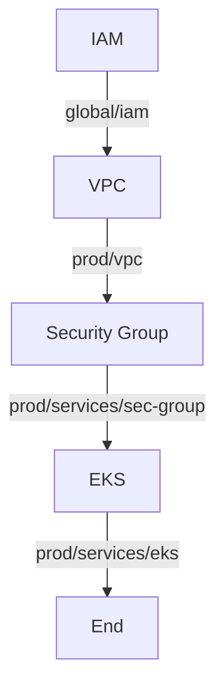

# AWS EKS SPOT INSTANCES


## AWS EKS Introduction

The Amazon Web Services EKS service allows for simplified management of Kubernetes servers.

## The architecture introduced

* Terrafrom technique is using on this project:

    ```
    1.Shared storage for state files.
    2.Isolating state files.
    3.Read-only state.
    ...
    ```
* kubernetes deployment technique is using on this project:
    ```
    1.Ingress.
    2.Spot Instance interrupt handler.
    ...
    ```
* AWS services technique is using on this project:
    ```
    1.EKS Cluster: AWS managed Kubernetes cluster of master servers.
    2.AutoScaling Group it support auto scaling along with the ability to control the mix of On-Demand and Spot based on the latest EKS Amazon Linux AMI: Operator managed Kuberneted worker nodes for running Kubernetes service deployments.
    3.Associated VPC, Internet Gateway, Security Groups, and Subnets: Operator managed networking resources for the EKS Cluster and worker node instances.
    4.Associated IAM Roles and Policies: Operator managed access resources for EKS and worker node instances.
    ...
    ```
* EKS 
## Directory structure

### Project directory


### Terraform-IAC directory

Terraform deploy service

```

terraform-IAC
├── README.md
├── global
│   ├── credential
│   └── iam
├── modules
│   ├── aws-eks
│   ├── aws-eks-node
│   ├── aws-iam
│   ├── aws-security-group
│   ├── aws-subnet
│   └── aws-vpc
└── prod
    ├── services
    │   ├── eks
    │   └── sec-group
    └── vpc

```

### Readme.md

Introduction guidelines

### Global

- credential: AWS credentials access_key and secret_key.
- iam: create and manages the AWS Identity and Access Management (IAM).

### Modules

- aws-eks: provision and manages an EKS Cluster.
- aws-eks-node: provision and manages an EKS Worker node.
- aws-iam: provision and manages Identity and Access Management.
- aws-security-group: Provides a security group resource.
- aws-subnet: Provides an VPC subnet resource.
- aws-vpc: Provides an VPC subnet resource.

### Prod

- User workspace the environment you wish to provision (prod in this case)
- services: the AWS service you wish to deploy
- eks : provisioning eks cluster
- sec-group: Provides a security group resource for eks cluster
- vpc: Provides an VPC subnet resource for eks cluster

## Preparation

In order to follow this guide you will need an AWS account and to have Terraform installed. [Configure your credentials](https://www.terraform.io/docs/providers/aws/index.html#authentication) so that Terraform is able to act on your behalf.

For simplicity here, we will assume you are already using a set of IAM credentials with suitable access to create AutoScaling, EC2, EKS, and IAM resources. If you are not sure and are working in an AWS account used only for development, the simplest approach to get started is to use credentials with full administrative access to the target AWS account.

If you are planning to locally use the standard Kubernetes client, kubectl, it must be at least version 1.10 to support exec authentication with usage of aws-iam-authenticator. For additional information about installation and configuration of these applications, see their official documentation.

For application you need to install helm CLI packages manager as well

Relevant Links:
[Kubernetes Client Install Guide ](https://kubernetes.io/docs/tasks/tools/install-kubectl/),
[AWS IAM Authenticator](https://github.com/kubernetes-sigs/aws-iam-authenticator),
[HELM CLI package Manager](https://eksworkshop.com/helm_root/helm_intro/install/)

## How To Provision EKS Cluster

Step to deploy service: deploy it one by one as bellow flow


Before to provisioning service you need to create the S3 services for storage the terrafrom state files as bellow infomation:

```
iam-role-terraform-remote-state
vpc-prod-terraform-remote-state
eks-cluster-prod-terraform-remote-state
sec-group-prod-terraform-remote-state

```
Terraform command deploy:
move to directory you wish to deploy and run command as bellow.

```
terraform init
terraform plan
terraform apply
```

## How To Connect To EKS Cluster

- Make sure you do installed the kubectl and aws-iam-authenticator on your client.
- Once you done to setup the EKS cluster the Terraform output generates a sample kubectl configuration to connect to your cluster. This can be placed into a Kubernetes configuration file, e.g. ~/.kube/config

```
kubeconfig =

apiVersion: v1
clusters:
- cluster:
    server: https://BC7124BA62xxxxxxxxxxxxx.yl4.ap-southeast-1.eks.amazonaws.com
    certificate-authority-data: LS0tLS1CRUdJTiBDRVJUSUZJQ0FURS0tLS0tCk1JSUN5RENDQWXxxxxxxXXXXxxxXxxXxQkFRc0ZBREFWTVJNd0VRWURWUVFERXdwcmRXSmwKY201bGRHVnpNQjRYRFRFNU1EWXlNVEE0TURBek5Gb1hEVEk1TURZeE9EQTRNREF6TkZvd0ZURVRNQkVHQTFVRQpBeE1LYTNWaVpYSnVaWFJsY3pDQ0FTSXdEUVlKS29aSWh2Y05BUUVCQlFBRGdnRVBBRENDQVFvQ2dnRUJBTHhGCkNGVldCOVplemhHODBzS0cvendGS0J2dlBKdUljWlJ3TXV4d0xVWHJtcTNJenByZWZhMjUySDB4LzVtVTk5NkYKd1FMV0s1eW81WWM5SGlkeWtmYzNQYXJKNHJOZHRsZ0MyRm9FV2ZvMXlyenQyWlIrVUg0cWxDbjB1OWxHN3JJLwpEOVljTlZQZ2dxSkdGZG9hMG5aR2hoTlV3WXM0dC9QY3lWWHJ6T285R0U5RlBsdkc1WlF6QXoyYnVIbmxjUDZUCnQ4d0NwZ25OVTdFYVBLWlVNeTUxMElQd0t2cHNKXXXXXXXXXXXXXXJc0MyQUxkRVpUcXRDM2FEaFoKUjZkT2JhVnpndkZhQ2ZjYVpaaGh0cWhta0RyUTVxcWZoZzlTbWNFVHprMTlIdDlLeFZReGRYUFZUWXF2ZkIrQQo0R29vb2pJRlVLMHJFUXM4UFEwQ0F3RUFBYU1qTUNFd0RnWURWUjBQQVFIL0JBUURBZ0trTUE4R0ExVWRFd0VCCi93UUZNQU1CQWY4d0RRWUpLb1pJaHZjTkFRRUxCUUFEZ2dFQkFJL1FhbG5QKy9nSS83TVY0RjNHYXJBdVJmUy8KWmJHQzVxLzN1UUdIdCt2VThwTDZIREpLc0VmeVhWejFoelhFZWF0RU1OZUwrVHB1dHpJeW1JK0dUOTJSblJ5Wgo2WngxSGQzQmhtQXV3U01BTW9xd0lTQkxCelhyZ2JBNS9vdDdjUG9BVlN0eUsxT3JqQ0EwU2FiREdYd1h4b3BZCkl6SCtGREFQQllUVHFvWldRaHRmQkYzRWRxNG9WRHFiZXNPMUVaZVNGWXJ0dlludlFRN0RWeVZoRksxUVZMNG0KMFJiSVlBOUxrYUFjVWVaZlhpMFQ3azh1TldHcWVOV2JieTYvUytWcm9EZE9DN2pYakVOR21nYzBPbWdIUkxiUQo1ZnBBelNZTEZlNWk5MkdFbmtmL2RKK1pVRHExek9Nb1R0eWpsdXNtaFIvdEdGOExVSHRKNHErdjxxxxxxxxxxxxxo=
  name: kubernetes
contexts:
- context:
    cluster: kubernetes
    user: aws
  name: aws
current-context: aws
kind: Config
preferences: {}
users:
- name: aws
  user:
    exec:
      apiVersion: client.authentication.k8s.io/v1alpha1
      command: aws-iam-authenticator
      args:
        - "token"
        - "-i"
        - "prod"
```


### Configuration to Join Worker Nodes

The EKS service does not provide a cluster-level API parameter or resource to automatically configure the underlying Kubernetes cluster to allow worker nodes to join the cluster via AWS IAM role authentication.
To output an example IAM Role authentication ConfigMap from your Terraform configuration:

```
terraform output config_map_aws_auth                                            


apiVersion: v1
kind: ConfigMap
metadata:
  name: aws-auth
  namespace: kube-system
data:
  mapRoles: |

    - rolearn: arn:aws:iam::608376549375:role/eks-node-role
      username: system:node:{{EC2PrivateDNSName}}
      groups:
        - system:bootstrappers
        - system:nodes
```
* Run terraform output config_map_aws_auth and save the configuration into a file, e.g. config_map_aws_auth.yaml
* Run kubectl apply -f config_map_aws_auth.yaml
* You can verify the worker nodes are joining the cluster via: kubectl get nodes --watch


## How To Deploy Apps Using HELM

* You need to install setup and deploy the helm service package manager as [link](https://www.digitalocean.com/community/tutorials/how-to-install-software-on-kubernetes-clusters-with-the-helm-package-manager#prerequisites) 